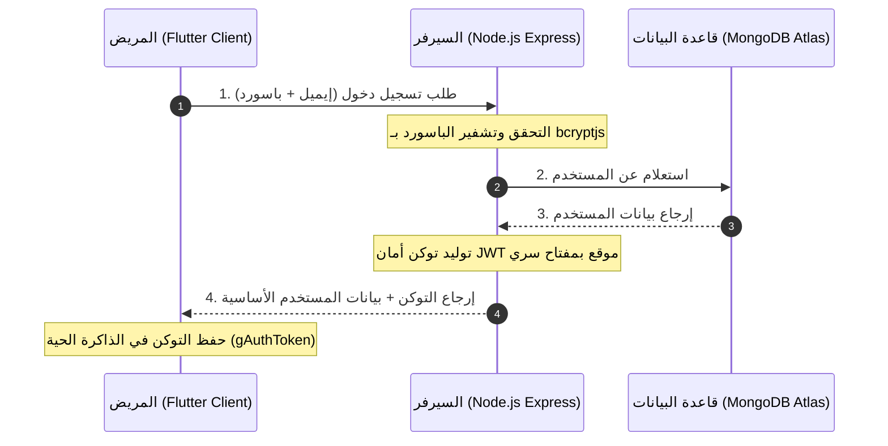

# 🔗 دليل الربط والاتصال الكامل والشامل (Integration & Data Flow Guide)

يا معلم، هذا الملف هو "كتالوج التشغيل الفني" الذي يشرح بـ "الحرف" و "التفصيل الدقيق" كيف يتحدث الفرونت إند (Flutter) مع الباك إند (Node.js) وكيف يتبادلان البيانات، وكيف يتم حفظ وتعديل البيانات في قاعدة البيانات (MongoDB Atlas). سنشرح هنا دورة حياة البيانات والأجهزة والشبكات بالكامل لتكون الصورة واضحة أمامك كمهندس برمجيات محترف!

---

## 🗺️ المخطط العام للاتصال (System Architecture & Connection)

يعتمد النظام على بنية **Client-Server Architecture**، وتتم جميع الاتصالات عبر بروتوكول **HTTP/HTTPS** باستخدام طلبات **RESTful API** ونقل البيانات بصيغة **JSON**.



---

## 🔌 1. لغز شبكة المحاكيات والهواتف (The Networking Puzzle)

واحدة من أكبر المشاكل التي تواجه المطورين هي فشل الاتصال بين الموبايل والسيرفر. إليك حل اللغز بالتفصيل كما هو مطبق في ملف `lib/core/config.dart`:

* **لماذا لا نستخدم `localhost` دائماً؟**
  * عندما تشغل السيرفر على جهازك، فإنه يستمع للمنفذ `localhost:3000`.
  * **محاكي الأندرويد (Android Emulator):** يعتبر جهازاً افتراضياً مستقلاً تماماً (Virtual Machine). إذا طلبت منه الاتصال بـ `localhost` فإنه سيبحث داخل المحاكي نفسه ولن يجد السيرفر! لذلك، قامت جوجل بحجز عنوان IP خاص وهو **`10.0.2.2`** كجسر يعبر من المحاكي إلى جهاز الكمبيوتر المضيف (Host Machine).
  * **محاكي الآيفون (iOS Simulator):** يشارك الكمبيوتر نفس الشبكة مباشرة، لذا يمكنه الاتصال بـ `localhost` أو `127.0.0.1` بدون مشاكل.
  * **الهاتف الحقيقي (Physical Device):** إذا كنت تجرب التطبيق على هاتفك المحمول المتصل بالواي فاي، يجب أن يتصل الهاتف بالـ IP المحلي لجهاز الكمبيوتر (مثال: `192.168.1.5`).

### ⚙️ كود إدارة الشبكة الذكي في التطبيق (`lib/core/config.dart`):
```dart
const bool _usingPhysicalDevice = false; // اجعلها true لو بتجرب على موبايل حقيقي
const String _computerIpAddress = '192.168.1.5'; // الـ IP الخاص بجهاز الكمبيوتر في شبكتك المحلية
const String _port = '3000';

String get kApiBaseUrl {
  if (kIsWeb) {
    return 'http://localhost:$_port'; // المتصفح متصل مباشرة بنفس الجهاز
  }
  if (_usingPhysicalDevice) {
    return 'http://$_computerIpAddress:$_port'; // الهاتف الحقيقي
  } else {
    if (defaultTargetPlatform == TargetPlatform.android) {
      return 'http://10.0.2.2:$_port'; // الأندرويد محاكي
    }
    return 'http://localhost:$_port'; // iOS محاكي أو ديسكتوب
  }
}
```

---

## 🔐 2. نظام التوثيق والأمان (Authentication & Security Workflow)

يستخدم نظام DocLine معيار **JSON Web Tokens (JWT)** لإدارة الجلسات وحماية البيانات.

### 🔄 دورة حياة التوكن (Token Lifecycle):
1. **تسجيل حساب جديد أو تسجيل الدخول:**
   عندما يرسل المريض بياناته، يتحقق الباك إند منها ويقوم بإنشاء توكن أمان مشفر وموقع يحتوي على معرف المستخدم ودوره:
   ```javascript
   const token = jwt.sign(
     { id: newUser._id, role: newUser.role },
     process.env.JWT_SECRET
   );
   ```
2. **الاستقبال والحفظ في الفرونت إند:**
   يستقبل تطبيق فلوتر التوكن في استجابة الـ API ويقوم بحفظه في متغير عالمي (`gAuthToken`) في ملف `lib/data/fake_data.dart`:
   ```dart
   gAuthToken = data['token'];
   ```
3. **إرسال التوكن مع كل طلب محمي:**
   عند رغبة المريض في جلب مواعيده أو حجز موعد، يجب إرسال التوكن في هيدر الطلب الشبكي تحت مسمى `Authorization` بصيغة `Bearer <TOKEN>` كما هو مبرمج في ملف `lib/services/api_service.dart`:
   ```dart
   Map<String, String> _headers({bool requireAuth = true}) {
     final headers = {
       'Content-Type': 'application/json; charset=UTF-8',
     };
     if (requireAuth && gAuthToken != null) {
       headers['Authorization'] = 'Bearer $gAuthToken';
     }
     return headers;
   }
   ```
4. **التحقق والحماية في الباك إند:**
   يستقبل السيرفر الطلب، ويمرره أولاً على الحارس `auth` في ملف `backend/middleware/auth.js` لفك تشفير التوكن والتحقق من صحته وصلاحيته. إذا كان التوكن سليماً، يسمح للطلب بالوصول لقاعدة البيانات وإرجاع البيانات المطلوبة، وإلا يرجع خطأ `401 Unauthorized` فوراً!

---

## 💾 3. تكامل النماذج وتطابق قواعد البيانات (Models Mapping)

لضمان عدم حدوث أخطاء أثناء تبادل البيانات، تتطابق النماذج في الفرونت إند والباك إند تماماً:

| الحقل في الموديل (Dart - Flutter) | الحقل في الموديل (Mongoose - Node.js) | الوصف ونوع البيانات |
| :--- | :--- | :--- |
| `id` | `_id` (ObjectId) | المعرف الفريد التلقائي من MongoDB |
| `name` | `name` (String) | الاسم الكامل للمستخدم |
| `email` | `email` (String) | البريد الإلكتروني (فريد ومصغر الأحرف) |
| `role` | `role` (String) | دور المستخدم: `patient` أو `doctor` أو `admin` |
| `specialty` | `specialty` (String) | التخصص الطبي (خاص بالطبيب) |
| `price` | `price` (String) | سعر كشف الطبيب (مثال: '300 EGP') |
| `bio` | `bio` (String) | السيرة الذاتية والنبذة التعريفية للطبيب |
| `workplaceType` | `workplaceType` (String) | مكان العمل: 'عيادة' أو 'مستشفى' |
| `governorate` | `governorate` (String) | المحافظة المتواجد بها الطبيب |
| `address` | `address` (String) | العنوان التفصيلي للعيادة |
| `age` | `age` (String) | عمر المريض (خاص بالمريض) |
| `painLocation` | `painLocation` (String) | مكان الألم والشكوى الأساسية |
| `description` | `description` (String) | الوصف التفصيلي للأعراض المرضية |
| `profileCompleted`| `profileCompleted` (Boolean) | علامة استكمال ملف البيانات الشخصية |

---

## 📈 4. تتبع تفصيلي لدورة الحجز (The Booking Flow Lifecycle)

إليك كيف يتم حجز موعد بالتفصيل الممل من لحظة ضغط المريض وحتى مراجعة الطبيب:

### 🚶‍♂️ المرحلة الأولى: المريض يطلب حجزاً
1. في صفحة `AppointmentBookingPage` يختار المريض التاريخ ويكتب وصف الألم والشكوى ثم يضغط زر **"تأكيد الحجز"**.
2. يقوم تطبيق فلوتر بالنداء على دالة `createBooking` في `ApiService`:
   ```dart
   Future<Map<String, dynamic>> createBooking({
     required String doctorId,
     required String doctorName,
     required String date,
     required String description,
     required String price,
   }) async { ... }
   ```
3. يرسل الفرونت طلب `POST` إلى العنوان `/api/bookings` حاملاً التوكن في الهيدر، والبيانات التالية في الجسم (Body):
   ```json
   {
     "doctorId": "65b9a8f...",
     "doctorName": "د. علي عبد الرحمن",
     "date": "2026-05-20T10:00:00.000Z",
     "description": "أشعر بألم خفيف في الصدر عند المجهود",
     "price": "350 EGP"
   }
   ```
4. يستقبل الباك إند الطلب، ويتحقق من التوكن لاستخراج هوية المريض الحالي (`patientId` و `patientName` و `patientEmail`).
5. ينشئ السيرفر سجلاً جديداً في جدول **Booking** بحالة افتراضية **`pending`** (قيد الانتظار) ويحفظه في قاعدة البيانات، ثم يعيد السجل المنشأ كاملاً للفرونت إند لتحديث الشاشة وعرض رسالة نجاح الحجز.

---

### 🩺 المرحلة الثانية: الطبيب يراجع ويقرر
1. يفتح الطبيب تطبيق الموبايل، ويسجل دخوله ببياناته الخاصة (مثال: `doctor.ali@gmail.com` / `doctor123`).
2. يقوم التطبيق تلقائياً بالنداء على السيرفر لجلب الحجوزات الخاصة بهذا الطبيب فقط عبر المسار `/api/bookings/doctor` باستخدام توكن الطبيب بالطبع.
3. يعرض تطبيق فلوتر في صفحة `DashboardPage` قائمة الحجوزات الواردة بحالة `pending`.
4. يظهر أمام الطبيب خياران تفاعليان:
   * **الخيار الأول: زر التأكيد (Confirm ✔️)**
     * عند الضغط عليه، يرسل الفرونت إند طلب `PUT` إلى العنوان `/api/bookings/:bookingId/status` ومعه في الجسم الحقيقي `{"status": "confirmed"}`.
   * **الخيار الثاني: زر الإلغاء (Cancel ❌)**
     * عند الضغط عليه، يرسل الفرونت إند نفس الطلب ومعه الحجم `{"status": "cancelled"}`.
5. يستقبل السيرفر الطلب، ويتأكد أن الطبيب الذي يطلب التعديل هو نفسه صاحب هذا الحجز منعاً للاختراقات والتلاعب بالبيانات، ثم يقوم بتحديث السجل في **MongoDB Atlas** وإرسال إشارة النجاح للتطبيق لتتحول حالة الموعد فوراً أمام الطبيب وفي لوحة تحكم المريض!

---

بهذا الشكل يا معلم يتم الربط البرمجي الفائق الأمان والسرعة بين طبقات المشروع الثلاثة! أصبحت الآن على دراية كاملة بآلية عمل كل سطر كود شبكي داخل نظام **DocLine**. 🚀💡
